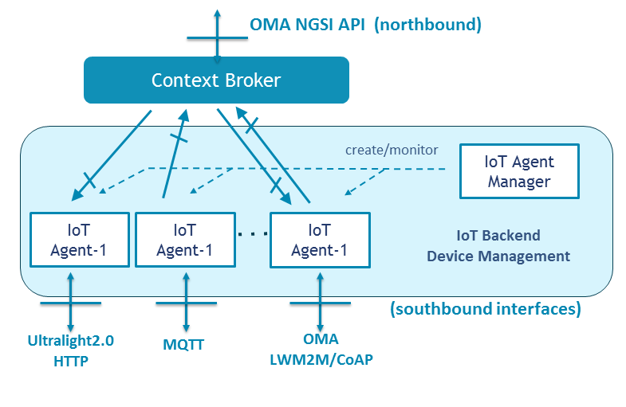

Connecting “objects” or “things” involves the need to overcome a set of problems arising in the different layers of
the communication model. Using its data or acting upon them requires interaction with a heterogeneous environment of
devices running different protocols (due to the lack of globally accepted standards), dispersed and accessible through
multiple wireless technologies.

Devices have a lot of particularities so it is not feasible to provide a solution where one size fits all. They are
resource constrained and can’t use full standard protocol stacks: they cannot transmit information too frequently due
to battery drainage, they are not always reachable since they are connected through heterogeneous wireless networks,
their communication protocols are too specific and lack integrated approach, and they use different data encoding
languages, so it is tricky to find a global deployment.

This component allows to simplify the management and integration of devices. It collects data from devices using
heterogeneous protocols and translates them into the standard platform language: NGSI entities (allowing also to send
commands to devices).

The platform supports several IoT protocols with a modular architecture where the modules are called “IoT Agents”.
Therefore, integrators need to determine first which protocol they will be using to connect devices and select the
right IoT Agent to use.

# Supported protocols

If you are interested in more details about how to connect your devices and sensors to the platform check out the
[Device API section](device_api.md).

At present, the following IoT Agents and supported IoT protocols in the IoT Platform are:

- [Ultralight 2.0](https://github.com/telefonicaid/iotagent-ul/tree/release/1.1.0): SensorML based simple text protocol.
- [JSON](https://github.com/telefonicaid/iotagent-json/tree/release/1.3.0): a JSON based key-value pair protocol.

Both IOTAgents work with either HTTP or MQTT as the transport protocol.

More IoT Agents are available in the comunity, that you can use in your local deployments (but are not yet available in
the Platform):

- [OMA LWM2M](https://github.com/telefonicaid/lightweightm2m-iotagent)
- [Thinking Things Open](https://github.com/telefonicaid/iotagent-thinking-things)

# New protocols

If the device uses a different protocol from the provided, it will be necessary to perform a translation between the
device specific platform and the platform standard model (NGSI). For that, different IoT Agents development frameworks
are provided:

- [Node.js framework](https://github.com/telefonicaid/iotagent-node-lib/tree/release/2.1.0)
- [IoT Agents C++ framework](https://github.com/telefonicaid/fiware-IoTAgent-Cplusplus) (deprecated)

In most of the supported IoT protocols, you will need a "secret key" that will be used by the platform to guarantee
that devices are allowed to send data to the platform.

Specific device provisioning or registration is not required, unless you need to modify some specific parameters from
the device (i.e. timezone, attributes mapping to Context Broker) or want to setup device commands.

# Reference API documentation

Provisioning API is specified here:
 
- [IoT Agents Manager](http://docs.telefonicaiotiotagents.apiary.io/)

