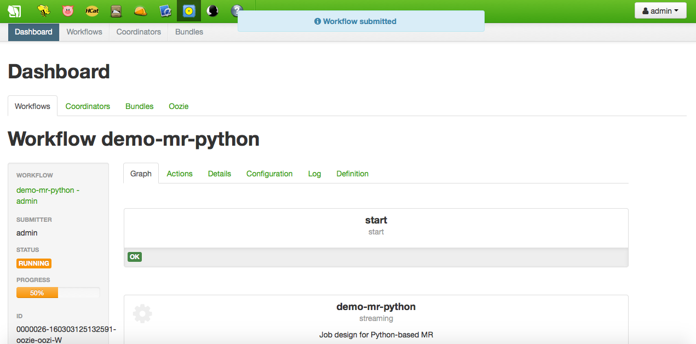

Big data within [Hadoop](http://hadoop.apache.org/) clusters is mainly analyzed by means of the [MapReduce](https://en.wikipedia.org/wiki/MapReduce) paradigm. Usually, specific Java jobs are created for this purpose, but sometimes different programming languages may want to be used, such as Python or even Shell scripting. In that cases, [Hadoop Streaming](https://hadoop.apache.org/docs/current/hadoop-streaming/HadoopStreaming.html) is the feature the IoT Platform integrators need.

Following, two methods are shown for creating Python-based MapReduce jobs using [Hue](http://gethue.com/) (the Web interface for Hadoop) and specifically, the Job Designer and Oozie Editor tools. Previously, some setup steps must be done, such as creating and uploading the Python code for mappers and reducers, or uploading some testing data files.

#Setup
##Python code
It is necessary to provide a couple of Python scripts, one implementing the mappers logic, and another implementing the reducers logic. These two files will be passed as arguments of the MapReduce later when it is executed. For demostration purposes the following [code](http://www.michael-noll.com/tutorials/writing-an-hadoop-mapreduce-program-in-python/) mimicking the Java-based WordCount application will be used:

```Python
$ cat mapper.py
#!/usr/bin/env python

import sys

# input comes from STDIN (standard input)
for line in sys.stdin:
    # remove leading and trailing whitespace
    line = line.strip()
    # split the line into words
    words = line.split()
    # increase counters
    for word in words:
        # write the results to STDOUT (standard output);
        # what we output here will be the input for the
        # Reduce step, i.e. the input for reducer.py
        #
        # tab-delimited; the trivial word count is 1
        print '%s\t%s' % (word, 1)

```

```Python
$ cat reducer.py
#!/usr/bin/env python

from operator import itemgetter
import sys

current_word = None
current_count = 0
word = None

# input comes from STDIN
for line in sys.stdin:
    # remove leading and trailing whitespace
    line = line.strip()

    # parse the input we got from mapper.py
    word, count = line.split('\t', 1)

    # convert count (currently a string) to int
    try:
        count = int(count)
    except ValueError:
        # count was not a number, so silently
        # ignore/discard this line
        continue

    # this IF-switch only works because Hadoop sorts map output
    # by key (here: word) before it is passed to the reducer
    if current_word == word:
        current_count += count
    else:
        if current_word:
            # write result to STDOUT
            print '%s\t%s' % (current_word, current_count)
        current_count = count
        current_word = word

# do not forget to output the last word if needed!
if current_word == word:
    print '%s\t%s' % (current_word, current_count)
```

The above two local files must be uploaded somewhere in the HDFS user space, using Hue's File Browser; for this document we'll assume the `admin` user and the `hdfs:///user/admin/demo-mr-python/python` folder:


##Data
Just upload any non binary local file of your choice to `hdfs:///user/admin/demo-mr-python/input` using Hue's File Browser:

```
$ cat data.txt 
Lorem ipsum dolor sit amet, consectetur adipiscing elit, sed do eiusmod tempor incididunt ut labore et dolore magna aliqua. Ut enim ad minim veniam, quis nostrud exercitation ullamco laboris nisi ut aliquip ex ea commodo consequat. Duis aute irure dolor in reprehenderit in voluptate velit esse cillum dolore eu fugiat nulla pariatur. Excepteur sint occaecat cupidatat non proident, sunt in culpa qui officia deserunt mollit anim id est laborum.
```


#Hadoop Streaming in Job Designer
This is the simplest way of creating a Python-based MapReduce job. First of all, access your Hue interface and start the Job Designer tool. Add a new action of type *streaming*:


Then, fill up the form specifying a name, a description and which are the Python scripts implementing the mapper and the reducer code. Please observe the location of those files is added as archive options. Finally, provide the input and output job properties:


As usual in Hadoop, the output directory must not exist previosly to the job execution.

The new streaming action will be added to the list of actions, and can now be submitted. While executing, the Oozie Dashboard is opened showing the progress; the Job Browser can be used for tracking the progress as well:


<br>


Once successfully finished, the output directory, which has been created by the job, can be browsed. As well as the content of the `part-0000` file, i.e. the data file word counts:


#Hadoop Streaming in Oozie Editor
This is an advanced way of creating a Python-based MapReduce job. By using the Oozie Editor you will be able to compose complex [Oozie](http://oozie.apache.org/) workflows of chained jobs, i.e. connecting the output of a job with the input of the next one in the workflow. Jobs can be MapReduce applications, of course, but Hive or Pig queries, Shell scripts or standard Java applications, and many other as well. Once defined the workflow, this can be submitted or scheduled for future execution.

Start by opening the Oozie Editor and select the Workflow tab. There, click the *Create* button for creating a new Oozie workflow:


First of all, choose a name for the workflow and provide a description. Then, the workflow editor will be opened:


It is time now to add nodes to the workflow; regarding this simple tutorial, just one a node of type *streaming* will be added. Simply drag and drop from the options above in the editor to the slot between the start and end nodes. Once droped, the node editor will be opened:


As can be seen, the streaming node configuration is the same than the one used in the Job Designer (see the previous section). More nodes could be added following the streaming one, nevertheless for this tutorial no more nodes are required. So, once configured the workflow is ready for being submitter or scheduled.


After submission, the output directory and its `part-0000` file can be browsed:

