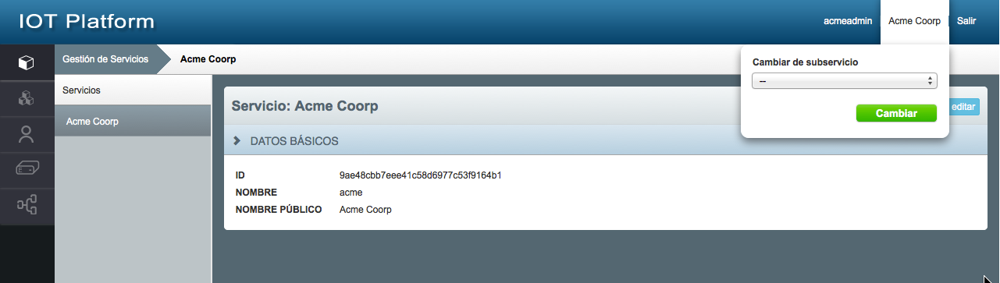
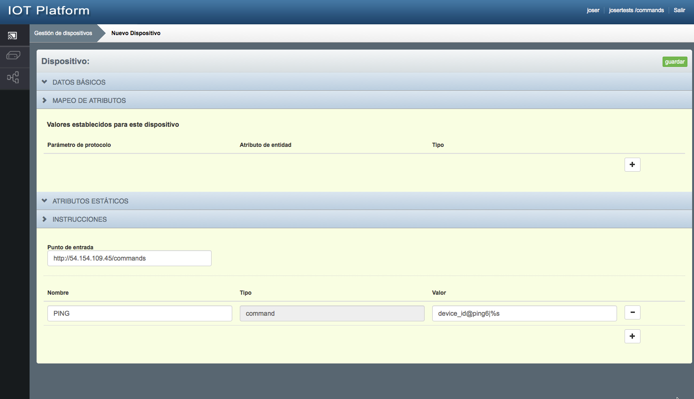

Getting started in 5 steps
==========================

### Step 0 - Get your account credentials

Please, check your inbox for an email with your credentials. It contains
these fields that are required for the following steps:


<table>
  <tr>
    <th>Field name</th>
    <th>Description</th>
  </tr>
  <tr>
    <td>{{apikey}}</td>
    <td>API Key used for devices to send data</td>
  </tr>
  <tr>
    <td>{{Fiware-Service}}</td>
    <td>Service name</td>
  </tr>
  <tr>
    <td>{{Fiware-ServicePath}}</td>
    <td>Sub-service name</td>
  </tr>
  <tr>
    <td>{{user-name}}</td>
    <td>User name for web portal</td>
  </tr>
  <tr>
    <td>{{user-password}}</td>
    <td>Password for web portal</td>
  </tr>
</table>


In order test the API, we really recommend you use the following sample
collection for [*POSTMAN extension for Google
Chrome*](https://chrome.google.com/webstore/detail/postman/fhbjgbiflinjbdggehcddcbncdddomop),
all this guide samples and some additional operations are there.

[*https://dl.dropboxusercontent.com/u/107902873/ttcloud/ttcloud-gettingstarted.zip*](https://dl.dropboxusercontent.com/u/107902873/ttcloud/ttcloud-gettingstarted.zip)

In that email, there is also attached a POSTMAN environment with your
credentials for this POSTMAN collection.

### Step 1 - Send the data from the device

Before doing any coding, identify the sensors on your device and decide
which data do you want to send to Thinking Things Cloud.

Sending data is as simple as sending an HTTP POST request using your API
key with your measures. Please use “\#” and “|” separators to split data
and measures.

HTTP method | POST      
----------- | ---- 
URL| http://test.ttcloud.net:8082/iot/d?k={{apikey}}&i=mydevice
HTTP Headers| -
HTTP Body | t|15.5\#p|1015\#g|40.516304/-3.661756\#a|"some-text"\#h|33.5


Take into account that no device provisioning or data modeling is
required in advance to send your device data. Anyway, we recommend to
use short magnitude identifiers (like “t”, “p” on the sample) to reduce
the message length sent from the device.

Your will simply receive an HTTP 200 OK response to confirm the data was
properly received at Thinking Things Cloud.

### Step 2 - See the data

Your device data is now stored in the Thinking Things Cloud, and your
can see it on the web portal. Please access the web portal with your
Username, Password and Fiware-Service:

[*http://test.ttcloud.net:8008/\#/*](http://test.ttcloud.net:8008/#/)

Now you have to switch to your subservice {{Fiware-ServicePath}} at
right top switch:



After that, you will see your device data the Entities list:


### Step 3 - Get the last data using the API

Now your know your data is stored in the Thinking Things Cloud, lets get
it via API.

First, you need to login in the API to get a valid token:
```
  ----------------------------------------------------------------
  **HTTP method**    POST
  ------------------ ---------------------------------------------
  **URL**            http://test.ttcloud.net:5001/v3/auth/tokens

  **HTTP headers**   Content-Type: application/json

  **HTTP**           {
                     
  **Body**           "auth": {
                     
                     "identity": {
                     
                     "methods": \[
                     
                     "password"
                     
                     \],
                     
                     "password": {
                     
                     "user": {
                     
                     "domain": {
                     
                     "name": "{{Fiware-Service}}"
                     
                     },
                     
                     "name": "{{user-name}}",
                     
                     "password": "{{user-pass}}"
                     
                     }
                     
                     }
                     
                     },
                     
                     "scope": {
                     
                     "domain": {
                     
                     "name": "{{Fiware-Service}}"
                     
                     }
                     
                     }
                     
                     }
                     
                     }
  ----------------------------------------------------------------
```

You will receive an HTTP 201 Created response with a header called
X-Subject-Token, this is your {{user-token}} like this:


 ```
  --------------------------------------------------------------------
  **HTTP**               201 Created
                         
  **Response**           
                         
  **code**               
  ---------------------- ---------------------------------------------
  **HTTP **              Content-Type: application/json
                         
  **Response headers**   Vary: X-Auth-Token
                         
                         X-Subject-Token: {{user-token}}

  **HTTP **              {
                         
  **Body**               "token": {
                         
                         "domain": {
                         
                         "id": "67576fe70df44bc280da74916a58d0f1",
                         
                         ....
                         
                         "issued\_at": "2015-07-03T07:43:42.517728Z"
                         
                         }
                         
                         }
  --------------------------------------------------------------------
```

Please, be careful pasting your {{user-token}} properly on next steps.
This is your API token and it will be valid for 3 years.

Now you are ready to invoke the API to get your device data. Just do an
HTTP GET request like this:

```
  ------------------------------------------------------------------------------------
  **HTTP method**    GET
  ------------------ -----------------------------------------------------------------
  **URL**            http://test.ttcloud.net:1026/v1/contextEntities/device:mydevice

  **HTTP headers**   Accept: application/json
                     
                     Fiware-Service: {{Fiware-Service}}
                     
                     Fiware-ServicePath: {{Fiware-ServicePath}}
                     
                     X-Auth-Token: {{user-token}}
  ------------------------------------------------------------------------------------
```

You will get you device data in a json document like this that is FIWARE
NGSI compliant:

```
  --------------------------------------------------------------
  **HTTP**               200
                         
  **Response**           
                         
  **code**               
  ---------------------- ---------------------------------------
  **HTTP **              Content-Type: application/json
                         
  **Response headers**   

  **HTTP **              {
                         
  **Body**               "contextElement": {
                         
                         "type": "device",
                         
                         "isPattern": "false",
                         
                         "id": "mydevice",
                         
                         "attributes": \[
                         
                         {
                         
                         "name": "TimeInstant",
                         
                         "type": "ISO8601",
                         
                         "value": "2015-06-25T14:13:54.953107"
                         
                         }
                         
                         ...
                         
                         \]
                         
                         },
                         
                         "statusCode": {
                         
                         "code": "200",
                         
                         "reasonPhrase": "OK"
                         
                         }
                         
                         }
  --------------------------------------------------------------
```

Please, notice that you will see one attribute per sensor.


### Step 4 - Show in a dashboard

JSON documents are fine, but dashboards are better for humans. If you
want to create a responsive website to see your device data at Thinking
Things Cloud don’t do it from the scratch, just sign up at:

> [*https://freeboard.io/signup*](https://freeboard.io/signup)

After this, you will be able to create a dashboard:


Once your are at your new dashboard, create an Orion FIWARE datasource
per device.


On the FIWARE Orion datasource configuration introduce there your credentials and your device type and ID as retrieved on Step 3 from the Thinking Things Cloud API.


Now it’s time to add widgets to your dashboard, representing your device
data.

Anyway, you can always clone this sample freeboard and use it as a template for yours:


[*https://freeboard.io/board/69lZ9V*](https://freeboard.io/board/69lZ9V)

### Step 5 - Send commands to the device

You can send commands to the device in order to trigger any action like
turning on a LED or a relay. In order to do so, you need to set your
device at the website.

First, create a new device on the “Devices” management tab:


After that, register a new command for the device taking into account:

-   Endpoint: if your device has a public IP, we will push the commands
    > to that URL. Otherwise, the commands can be polled.

-   Command value: it must follow these convention
    > device\_id@{{command\_name}}|%s



Remember that you can also setup your device via API, you will find an
example on the POSTMAN collection.

Once the command is configured, you can send commands to the device just
updating the entity attribute associated to that command, or using the
web interface.

On the Entities section, select the entity linked to that device and
click on the “Send Command” green button to submit it.


The commands will be received on the device endpoint if configured on
the device setup. Remember that if you left that field empty, the
commands can be pulled directly from the device:

```
  **HTTP method**    GET
  ------------------ ------------------------------------------------------------
  **URL**            http://test.ttcloud.net:8082/iot/d?k={{apikey}}&i=mydevice
  **HTTP headers**   -
```

The command received will be as follows:

```
  --------------------------------------------------------------------------
  **HTTP Response code**   200
  ------------------------ -------------------------------------------------
  **HTTP Body**            device\_id@{{command\_name}}|{{comand\_params}}
  --------------------------------------------------------------------------
```


### In more detail …

**Sending data**

Devices can provide data using many other protocols like MQTT or COAP,
it is also feasible to set different timestamps, configure customized
mappings between physical device and virtual entity, or provision
measures via HTTP GET. Read the full detail at:

[*https://drive.google.com/open?id=1TfpQdPcU\_tE\_hl79y-4r\_Znk8ZGYAZzQsmvZ4ZWu6yg*](https://drive.google.com/open?id=1TfpQdPcU_tE_hl79y-4r_Znk8ZGYAZzQsmvZ4ZWu6yg)

**Last Data API**

Thinking things data API is FIWARE NGSI compliant so it provides lots of
features: subscriptions, partial updates, bulk entities retrieval,
regular expression queries, geolocated entities search.

[*http://es.slideshare.net/fermingalan/fiware-managing-context-information-at-large-scale*](http://es.slideshare.net/fermingalan/fiware-managing-context-information-at-large-scale)

Read the full reference at:

[*https://forge.fiware.org/plugins/mediawiki/wiki/fiware/index.php/Publish/Subscribe\_Broker\_-\_Orion\_Context\_Broker\_-\_User\_and\_Programmers\_Guide*](https://forge.fiware.org/plugins/mediawiki/wiki/fiware/index.php/Publish/Subscribe_Broker_-_Orion_Context_Broker_-_User_and_Programmers_Guide)

**Historic Data API**

Historic data is accessible using the Short Term historic API.

Example:

```
  -------------------------------------------------------------------------------------------------------------------------------
  **HTTP method**    GET
  ------------------ ------------------------------------------------------------------------------------------------------------
  **URL**            <http://test.ttcloud.net:8666/STH/v1/contextEntities/type/device/id/device:mydevice/attributes/h?lastN=10>

  **HTTP headers**   Accept: application/json
                     
                     Fiware-Service: {{Fiware-Service}}
                     
                     Fiware-ServicePath: {{Fiware-ServicePath}}
                     
                     X-Auth-Token: {{user-token}}
  -------------------------------------------------------------------------------------------------------------------------------
```

Remember that in order to collect historic data, it is necessary to
configure the required subscription (endpoint:
http://test.ttcloud.net:8666/notify).

More info:
[*https://github.com/telefonicaid/IoT-STH*](https://github.com/telefonicaid/IoT-STH)

**New accounts and subservices**

You can create new users and credentials at the web portal. It is also
possible to have different subservices in order to segment properly your
data.

[*https://drive.google.com/open?id=0BwLx3ffvQDehSktHdElKOTg3dWs*](https://drive.google.com/open?id=0BwLx3ffvQDehSktHdElKOTg3dWs)

**Data visualization tools**

Do you need to show your devices on a map? want your data in a Google
Sheet? prefer to use Ducksboard for creating dashboards? Take a look to
our set of data visualization tools connectors:

[*https://github.com/telefonicaid/fiware-dataviz*](https://github.com/telefonicaid/fiware-dataviz)

Comments and improvements

We are happy to hear your feedback!

