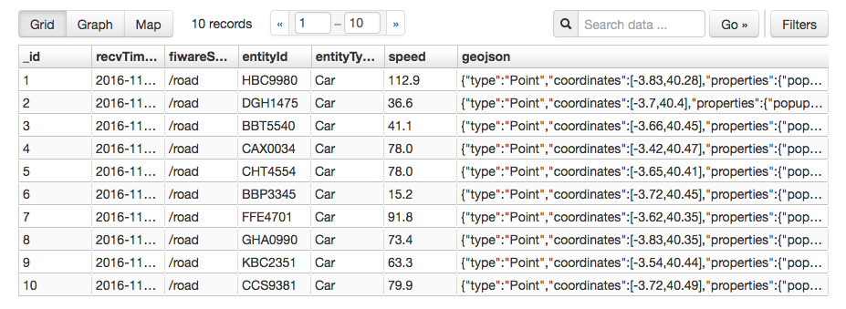
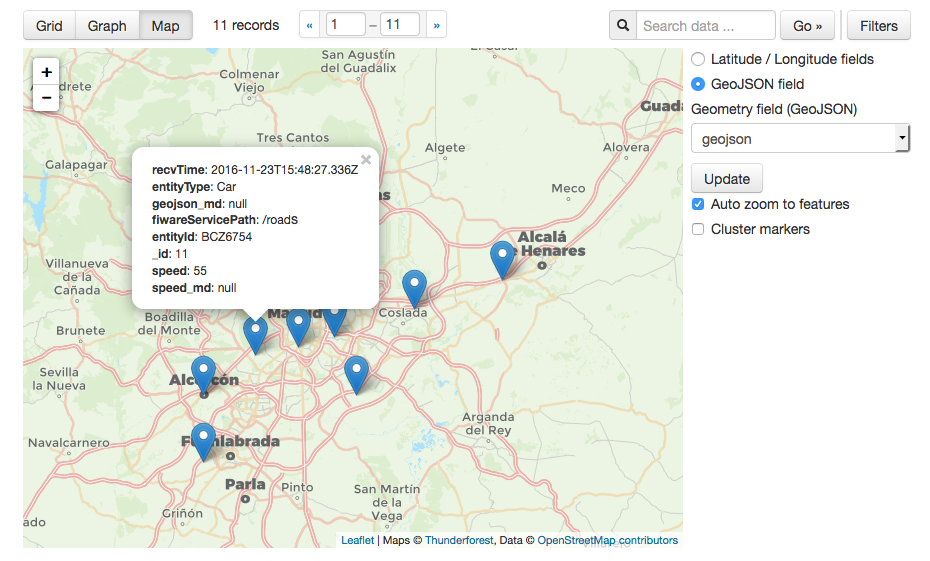

# Entities geolocalization

The platform allows entities geolocalization. In other words, entities may have an attribute which 
value is interpreted as the entity location, among the following types:

- A point, e.g. to model a Car entity which moves across a city.
- A line, e.g. to model a Street entity
- A polygon with an arbitrary number of vertex, e.g. to model a city neighborhood
- An arbitrary [GeoJSON](http://geojson.org)

Entities location is managed through the [Data API](../data_api.md) exposed by [Context Broker](../context_broker.md). See details at "Geospacial properties of entities" section at the [NGSIv2 specification](http://telefonicaid.github.io/fiware-orion/api/v2/stable/). The following example
shows how to set a `location` attribute for a given entity (which id is `Tenerife`) and which roughly corresponds to the Tenerife island surface
on Earth:

    PATCH /v2/entities/Tenerife/attrs/location
    Content-Type: application/json

    {
      "value": [ "28.362, -16.883", "28.003, -16.693", "28.552, -16.136", "28.520, -16.418", "28.396, -16.641", "28.362, -16.883" ]
      "type": "geo:polygon"
    }

With regards with entities corresponding to devices connected to the platform and managed by [IoT Agents](../device_gateway.md), you can
geo-locate them as `geo:point` using the model transformation functionality. Let's assume the same scenario shown in the [notifications scenario](how_notifications_work.md).
Sensor information can be reported either directly in the `latitude, longitude` format, or separately, by using expressions to combine the information
into a geo point. To do so, the car provisioning should be changed to reflect this new information. If the sensor information is sent using :

    POST /iot/groups
    Content-Type: application/json
    Fiware-service: smartown
    Fiware-servicepath: /roads

    {
      "groups": [
        {
          "protocol": [
                  "IoTA-UL"
                ],
          "apikey": "801230BJKL23Y9090DSFL123HJK09H324HV8732",
          "entity_type": "Car",
          "attributes": [
            {
              "object_id": "s",
              "name": "speed",
              "type": "Number"
            },
            {
              "object_id": "la",
              "name": "latitude",
              "type": "Integer"
            },
            {
              "object_id": "lo",
              "name": "longitude",
              "type": "Integer"
            },
            {
              "name": "location",
              "type": "geo:point",
              "expression": "${latitude}, ${longitude}"
            }
          ]
        }
      ]
    }

With this configuration, information from the car can be reported with the following request:

    POST /iot/d?k=801230BJKL23Y9090DSFL123HJK09H324HV8732&i=BCZ6754
    Content-Type: text/plain

    s|55|la|40.392|lo|-3.759

This will generate an update request to the context broker, setting the value of the attribute `location` to the value
`40.392, -3.759`, as defined by the expression.

Once the entities location is correctly configured, it can be exploited at different platform points. In particular:

- At the Data API, through geographical queries (both synchronous such as
  `GET /v2/entities` or asynchronous as part of a subscription filter). See "Geographical Queries" section at the [NGSIv2 specification](http://telefonicaid.github.io/fiware-orion/api/v2/stable/). For example, in order to get all the Car devices 15 km close to the Madrid city center the
  following query could be used.

        GET /v2/entities?type=Car&georel=near;maxDistance:15000&geometry=point&coords=40.418889,-3.691944 
        Fiware-service: smartown
        Fiware-servicepath: /roads

- At the [CEP API](../cep_api.md). CEP is able to process entity point locations
  (other shapes as line, polygon, etc. not yet supported) so its latitude and
  longitude can be easily used in EPL conditions. See [CEP documentation](https://github.com/telefonicaid/perseo-fe/blob/master/documentation/plain_rules.md#location-fields) for more detail. For example, the following rule will send an email when the entity with attribute `location` is 
  less than 5 km far away from Cuenca. It uses the circle equation, `(x - a)^2 + (y - b)^2 = d^2`, being (a, b) 618618.8286057833 and 
  9764160.736945232 the UTMC coordinates of Cuenca and d the distance of 5000 m.

		{
		    "name": "rule_distance",
		    "text": "select *, \"rule_distance\" as ruleName from pattern [every ev=iotEvent(Math.pow((cast(cast(location__x?,String),float) - 618618.8286057833), 2) + Math.pow((cast(cast(location__y?,String),float) - 9764160.736945232), 2) < Math.pow(5e3,2))]",
		    "action": {
		        "type": "email",
		        "template": "${id} (${type}) is at ${location__lat}, ${location__lon} (${location__x}, ${location__y})",
		        "parameters": {
		            "to": "someone@tid.es",
		            "from": "system@iot.tid.es",
		            "subject": "${id} is coming"
		        }
		    }
		} 

- Persistence backends:
    - CKAN (column mode): there are two ways of providing location, either using two columns (one for latitude
    another for longitude) or joining both in a single colum. See [Cygnus documentation](https://fiware-cygnus.readthedocs.io/en/master/cygnus-ngsi/flume_extensions_catalogue/ngsi_ckan_sink/index.html#section2.3.4) for more detail. Note this is not the standard way of mark entity location in the Data API (see aforementioned "Geospacial properties of entities" section) and probably would be aligned in the
    future to work in a similar way to the [Carto experimental persistence sink](http://fiware-cygnus.readthedocs.io/en/master/cygnus-ngsi/flume_extensions_catalogue/ngsi_cartodb_sink/index.html#section2.3.6).

    

    

<!--
To include in the Persisente backends section, once Carto sink would be ready for production usage:

  - Carto. Both point and arbitrary GeoJSON location are supported and correctly persisted
    at Carto. See [Cygnus documentation](http://fiware-cygnus.readthedocs.io/en/master/cygnus-ngsi/flume_extensions_catalogue/ngsi_cartodb_sink/index.html#section2.3.6) for more detail.
-->
