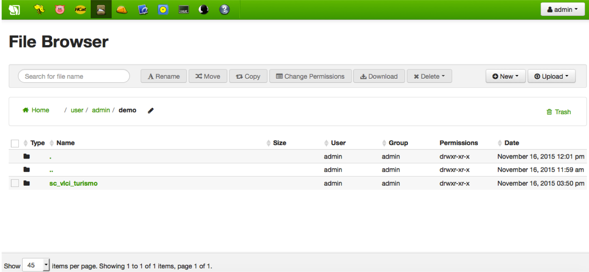

# How to massively move data from/to the Platform (Big Data)
Moving massive data from or to the IoT Platform means interacting with [Hadoop](http://hadoop.apache.org/)'s HDFS.

HDFS stands for Hadoop Distributed File System. It is, in fact, a file system, since the data is organized as large data files following a Unix file system design. And it is distributed, since the large data files are not hosted by a single server but by a cluster of servers, having the files split into many pieces (blocks) all along the cluster.

A special daemon, the NameNode, is in charge of managing HDFS, handling a table with file splits and their location within the data servers. This daemon talks with a set of DataNode's, i.e. the NameNode counterpart daemons running in the data servers.

Doing I/O with HDFS is as <i>easy</i> as talking with the NameNode and asking for read and write operations, and file management in terms of ownership, permissions, etc. as well.

There are several ways of interacting with a HDFS's Namenode. Let's see the ones supported by IoT Platform.

## Methods
### Using Hue
This method is mainly oriented to **non automated integrators** (i.e. human beings) since [Hue](http://gethue.com/) is a web-based UI for Hadoop. 

Hue exposes a dashboard where several plugins are available for different purposes. These plugins are just an interface wrapping both conventional Hadoop APIs and authentication mechanisms.

Among the plugins we can find available for Hue, and especifically for IoT Platform, there is the **File Browser**. Such a browser performs in a graphical way all the typical Linux-like operations, including I/O of data. Behind the scenes, Hue uses [WebHDFS](https://hadoop.apache.org/docs/current/hadoop-project-dist/hadoop-hdfs/HdfsUserGuide.html), Hadoop's REST API.

File Browser UI is quite straightforward:

Accessing Hue requires certain user credentials (user and password) that must be given by IoT Platform administrators. These users typically will match your Unix/Hadoop users and permissions, thus, a Hue user will belong to a single tenant/client (while a tenant/client may have several users) and will have limited access to HDFS (only to those HDFS account or accounts related to its tenant/client).

[Top](#top)

### Using a ETL process
ETL stands for Extract, Transform and Load. It is a term applied to processes in charge of moving data with some optional transformation in between.

The IoT Platform exposes a server intended for ETL purposes related to HDFS. It is a machine where an **integrator** may upload a Java program and schedule its execution through the Crontab.

Such ETL processes are allowed to obtain the original data from external sources, e.g. databases, and from private networks connected to clients.

Connection to HDFS is done by means Hadoop API for Java, i.e. executing Remote Procedure Calls (RPC) which execute through the TCP/8020 port.

Please ask the IoT Platform team for further details.

[Top](#top)
